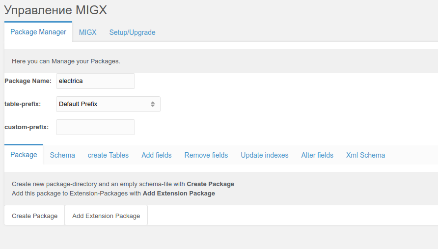
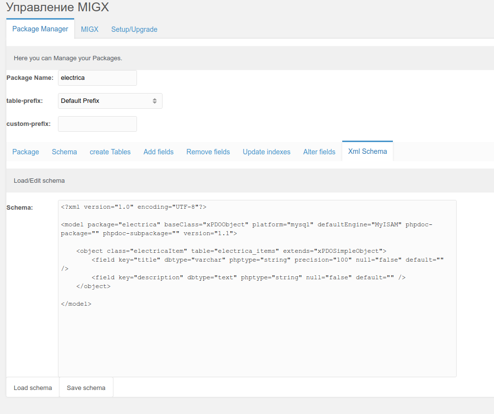

Beginners often have a question about how you can quickly create some kind of table and start working with it using the example from the snippet. I have always done through the modExtra package, cutting out from it what I do not need. But it is long and not very convenient if you need one or two tablets. MIGX solves this problem.

Let's start with the fact that we install MIGX and go into it. In the Package Manager tab, we need to enter the Package Name:



And click the Create Package button. In the directory `core/components/youpackagename` created the necessary files.
Now, we need to write the schema of the future table or tables. Very detailed on this is painted on one of the courses Basil. There is also official documentation.

We will create a simple example table:

``` xml
<?xml version="1.0" encoding="UTF-8"?>
<model package="electrica" baseClass="xPDOObject" platform="mysql" defaultEngine="MyISAM" phpdoc-package="" phpdoc-subpackage="" version="1.1">
    <object class="electricaItem" table="electrica_items" extends="xPDOSimpleObject">
        <field key="title" dbtype="varchar" phptype="string" precision="100" null="false" default="" />
        <field key="description" dbtype="text" phptype="string" null="false" default="" />
    </object>
</model>
```

and paste the schema into the Xml Scheme tab and press the Save Scheme button:



Everything, the scheme is ready. Now, go to the Create Table tab and click Create Tables. Now we have our tablet in the database:


Everything. Now we can work with our table.

``` php
<?php
// Add a package
if(!$modx->addPackage('electrica', MODX_CORE_PATH . 'components/electrica/model/')){
    return 'false';
}
// Create a record
$table = $modx->newObject('electricaItem');
$array = [
    'title' => 'What is the title',
    'description' => 'What is the description'
    ];

$table->fromArray($array);
$table->save();

// Do a sample
$response = $modx->getIterator('electricaItem');

foreach($response as $res){
    print_r($res->toArray());
}
```

This simple enough way you can quickly create your own tables and work with them.
