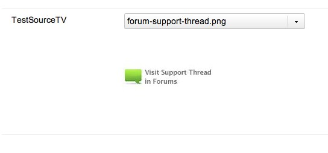

В этой статье описывается, как назначить источник файлов для TV. Рекомендуется прочитать статьяю [Добавление источника медиа](building-sites/media-sources/creating "Добавление источника медиа"), прежде чем читать эту.

Источники используют только TV типа «Изображение» и «Файл».

## Создание TV

Сначала мы начнем с создания TV, к которому мы будем подключать источник файлов. Создайте TV под названием «TestSourceTV» и сохраните его. Обратите внимание, тогда вы увидите новую вкладку на вашем телевизоре, вкладку «Источники медиа». Это будет иметь сетку [Контексты](building-sites/contexts "Контексты") которые доступны, и источники, связанные с этими контекстами.

Это означает, что TV могут использовать разные источники в контексте. Это вступит в силу при редактировании TV в ресурсе из этого контекста, а также при отображении этого TV в этом контексте.

А пока давайте назначим все контексты источнику «Мой новый источник», который мы создали в статье [Добавление источника медиа](building-sites/media-sources/creating "Добавление источника медиа"). Установите тип ввода вашего TV на вкладке «Параметры ввода» на «Изображение». Присвойте его шаблону. Сохраните свой TV.

## Ограничение источника определенными папками

Часто вам нужно, чтобы пользователи выбирали файлы из определенной папки при выборе значения для телевизора. Вы можете установить это ограничение, когда определяете ваш источник мультимедиа.

1. Во-первых, создайте ваш медиа-источник в **Медиа -> Источники файлов**
2. После создания источника мультимедиа щелкните его правой кнопкой мыши и выберите «Редактировать источник мультимедиа».
3. Прокрутите вниз и измените следующие параметры:

-   **basePath** - установить что-то вроде "assets/images/"
-   **baseUrl** - установить что-то вроде "assets/images/"

Оставить **basePathRelative** и **baseUrlRelative** в "Да". Это самый распространенный способ настроить это.

**basePath** и **baseUrl** должен начинаться без косой черты, но они должны заканчиваться косой чертой.

## Редактирование TV

Теперь, когда вы редактируете этот TV в ресурсе, вы заметите, что он использует источник, который мы создали ранее:

При нажатии на раскрывающееся меню загрузится окно MODX.Browser с использованием указанного источника - обратите внимание, что наш источник загружает только содержимое каталога `assets/`.

Теперь мы, вероятно, захотим рассмотреть возможность ограничения доступа к этому источнику, чтобы наши редакторы контента не могли случайно отредактировать его и испортить. Прочитайте [следующую статью](building-sites/media-sources/securing "Защита медиа источника") чтобы узнать, как.

## Смотрите также

1. [Добавление источника медиа](building-sites/media-sources/creating)
2. [Назначение медиа-источников для TV](building-sites/media-sources/assigning-to-tvs)
3. [Защита медиа источника](building-sites/media-sources/securing)
    1. [Руководство по созданию медиа источника для клиентов](building-sites/media-sources/securing/clients-tutorial)
4. [Типы медиа источника](building-sites/media-sources/types)
    1. [Тип медиа источника - File System](building-sites/media-sources/types/media-source-type-file-system)
    2. [Тип медиа источника - S3](building-sites/media-sources/types/media-source-type-s3)
