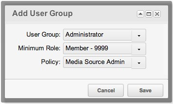
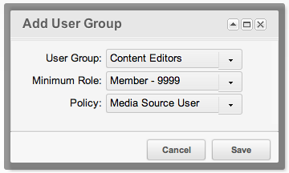

В этой статье описывается, как обеспечить источник мультимедиа для определенных групп пользователей. Рекомендуется прочитать статью [Добавление источника медиа](building-sites/media-sources/creating "Добавление источника медиа") прежде чем читать это. Прежде чем начать, создайте группу пользователей «Редакторы контента», если у вас ее еще нет.

Те, кто устанавливает новые версии MODX 2.2.0-pl, должны добавить строку `sources.modAccessMediaSource` в Системной настройке `principal_targets`.

## Блокировка нашего источника для администраторов

Источники мультимедиа используют общие ACL, которые использует [Система безопасности MODX](building-sites/client-proofing/security "Система безопасности MODX"). Вы можете прикрепить к ним политики через группы пользователей, которые позволяют ограничивать базовые действия с ними, такие как сохранение, загрузка и перечисление.

Перейдите к редактированию нашего источника «Мой новый источник», который мы создали в статье [Добавление источника медиа](building-sites/media-sources/creating "Добавление источника медиа"). Там, нажмите на вкладку «Права доступа». Вы увидите пустую сетку. Источники, которым не назначены пользовательские группы, являются «общедоступными» - в том смысле, что любой пользователь может их использовать, редактировать и просматривать.

Мы собираемся сначала заблокировать наш новый источник, чтобы его могли видеть и редактировать только администраторы. Нажмите на кнопку «Добавить группу пользователей» над сеткой. Это должно появиться окно:

Заполните его, как показано выше, отметив, что есть две доступных [Политики доступа](building-sites/client-proofing/security/policies "Политики доступа"). Политика «Media Source Admin» - это то, что нам нужно - она предоставляет полный доступ к источнику мультимедиа, включая просмотр, редактирование, удаление и распечатку. Другая - Media Source User - позволяет только просматривать и перечислять источник (в основном, политика только для чтения). Поскольку мы назначаем это нашей группе администраторов, мы хотим, чтобы они имели полный доступ.

Сохраните ваш источник. Сброс сеансов (Безопасность -> Сброс сеансов), а затем повторно войдите в систему менеджера. Теперь это будет доступно только администраторам.

Если пользователь, не являющийся администратором, попытается просмотреть или отредактировать телевизор в Ресурсе с помощью вашего теперь защищенного источника, он увидит только значение и не сможет его отредактировать. Это позволяет сохранять защищенные источники в телевизорах защищенными.

## Ограничение редакторов контента

Теперь, когда вы добавили ACL для администраторов, давайте также добавим для нашей группы редакторов контента. Добавьте еще одну ACL:

добавьте ее в таблицу и сохраните ваш источник. Это позволит всем пользователям в вашей группе пользователей редакторов контента иметь возможность видеть и использовать ваш источник, но не изменять его. Они смогут добавить его на TV, просмотреть его в дереве файлов и просмотреть источник, но не смогут ни редактировать сам источник, ни удалять его.

**Политика источника мультимедиа применяется к файлам и папкам, которые она предоставляет**
Политика источников мультимедиа определяет, что пользователь может делать с файлами, предоставленными источником мультимедиа, а не с самим источником мультимедиа. Политика «Администратор» предназначена для администрирования или управления файлами, а «Пользователь» - только для использования или доступа к файлам. В приведенном выше примере редакторы контента смогут получать доступ к файлам и папкам, предоставленным «Моим новым источником», просматривать их и выбирать их на телевизорах. Тем не менее, они **не смогут загружать** любые новые файлы **и создавать** любые файлы и каталоги. Для этого им потребуются более широкие разрешения, чем предусмотрено политикой «Media Source User». В этом случае следует использовать политику «Media Source Admin» или пользовательскую политику с настраиваемыми разрешениями.

Это конец основного использования Media Source. Не стесняйтесь узнавать о различных [Типы медиа источника](building-sites/media-sources/types "Типы медиа источника").

## Смотрите также

1. [Добавление источника медиа](building-sites/media-sources/creating)
2. [Назначение медиа-источников для TV](building-sites/media-sources/assigning-to-tvs)
3. [Защита медиа источника](building-sites/media-sources/securing)
    1. [Руководство по созданию медиа источника для клиентов](building-sites/media-sources/securing/clients-tutorial)
4. [Типы медиа источника](building-sites/media-sources/types)
    1. [Тип медиа источника - File System](building-sites/media-sources/types/media-source-type-file-system)
    2. [Тип медиа источника - S3](building-sites/media-sources/types/media-source-type-s3)
